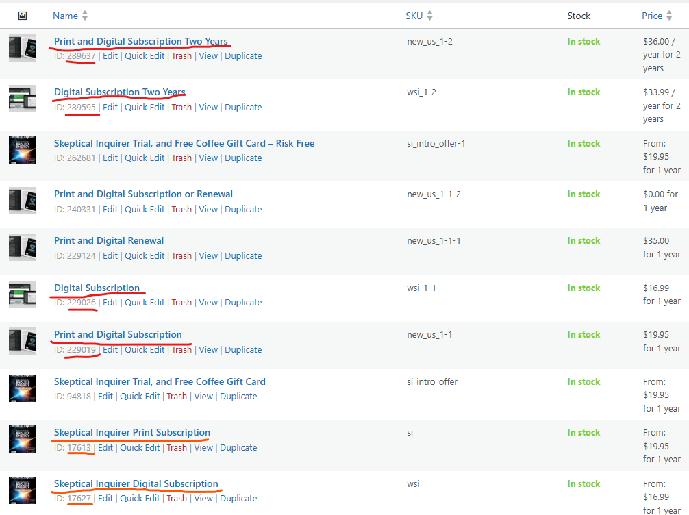

# Subscribe-Page Update Notes

## notes

*Where to find template files*

"The various template files on your WooCommerce site can be found via an FTP client or your hosts file manager, in /wp-content/plugins/woocommerce/templates/. Alternatively, you can find the template files on our repository on GitHub." -> https://github.com/woocommerce/woocommerce/blob/trunk/docs/theme-development/template-structure.md 


*Origin product pages*

Main subscribe page: https://skepticalinquirer.org/subscribe/

Product pages (legacy): https://skepticalinquirer.org/product/skeptical-inquirer-print-subscription/ https://skepticalinquirer.org/product/skeptical-inquirer-digital-subscription/

*Products on backend*



*Relevant WC Library Functions/Hooks*

- [WC_Form_Handler (Class)](https://wp-kama.com/plugin/woocommerce/function/WC_Form_Handler)

## DeepSeek

*Output 01*
Regarding htaccess

```
1. Recommended .htaccess Structure
In public_html/.htaccess (Root)
apache

<IfModule mod_rewrite.c>
RewriteEngine On
RewriteBase /
RewriteRule ^index\.php$ - [L]

# ALLOW REST API REQUESTS
RewriteCond %{REQUEST_URI} ^/wp-json/custom/v1/ [NC]
RewriteRule ^ - [E=HTTP_AUTHORIZATION:%{HTTP:Authorization},L]

# STANDARD WORDPRESS RULES
RewriteCond %{REQUEST_FILENAME} !-f
RewriteCond %{REQUEST_FILENAME} !-d
RewriteRule . /index.php [L]

# BLOCK DIRECT PHP ACCESS (except REST)
<Files *.php>
    Order allow,deny
    Deny from all
    <IfModule mod_headers.c>
        SetEnvIf Request_URI "^/wp-json/" allow
        Order allow,deny
        Allow from env=allow
    </IfModule>
</Files>
</IfModule>

In wp-content/.htaccess (Optional - only if needed)
apache

# DISALLOW DIRECT ACCESS TO PLUGINS/THEMES
Order deny,allow
Deny from all

# ALLOW REST API CALLS
<Files "rest-api.php">
    Allow from all
</Files>

2. Critical Verification Steps

    Check File Permissions:
    bash

chmod 644 public_html/.htaccess
chmod 644 wp-content/.htaccess

Test Endpoint Accessibility:
bash

# Test GET
curl -I "https://yoursite.com/wp-json/custom/v1/endpoint/"

# Test POST
curl -X POST "https://yoursite.com/wp-json/custom/v1/endpoint/" \
  -H "Content-Type: application/json" \
  -d '{"test":"data"}'

Debugging Tools:

    Add to wp-config.php:
    php

        define('WP_DEBUG', true);
        define('WP_REST_DEBUG', true);

3. Common Pitfalls & Fixes
Symptom	Solution
403 Forbidden	Remove redundant deny rules in wp-content/.htaccess
404 Not Found	Ensure index.php isn't missing rewrite rules
POST blocked	Add [E=HTTP_AUTHORIZATION:%{HTTP:Authorization}]
CORS issues	Add header rules for OPTIONS method
4. Production Security Checklist

    Restrict by IP (if possible):
    apache

<Files "debug.log">
    Order allow,deny
    Deny from all
    Allow from 192.168.0.1
</Files>

Rate Limiting (prevent abuse):
apache

    <IfModule mod_rewrite.c>
    RewriteCond %{REQUEST_URI} ^/wp-json/custom/v1/endpoint/
    RewriteCond %{REQUEST_METHOD} POST
    RewriteCond %{REMOTE_ADDR} !^123\.456\.789\.012
    RewriteRule .* - [F,L]
    </IfModule>

5. Final Recommendation

    Consolidate rules into public_html/.htaccess

    Remove redundant rules from wp-content/.htaccess

    Test incrementally after each change
```

*Output 02*
```
Current Limitations vs. WC_Product_Variation Approach
Your Current Approach	WC_Product_Variation Solution
Manages products as separate items	Treats durations as proper variations
Custom endpoint for cart updates	Uses native WC AJAX add-to-cart
Hardcoded product IDs	Dynamic variation selection
Step 1: Product Structure Refactor

    Convert Subscription Products

        Create a variable product (e.g., "Magazine Subscription")

        Add attributes:

            Duration (1-year, 2-year)

            Type (Product A, Product B)

    Set Up Variations
    php

    $variation_data = [
        'attributes' => [
            'duration' => '1-year',
            'type'     => 'product-a'
        ],
        'price' => 29.99
    ];
    $variation = new WC_Product_Variation();
    $variation->set_props($variation_data);
    $variation->save();

Step 2: Frontend Changes
HTML Structure
html

<select id="duration" class="variation-select">
    <option value="">Choose duration</option>
    <option value="1-year">1 Year - $29.99</option>
    <option value="2-year">2 Years - $49.99</option>
</select>

<select id="type" class="variation-select">
    <option value="">Choose type</option>
    <option value="product-a">Product A</option>
    <option value="product-b">Product B</option>
</select>

<button id="add-to-cart" data-product-id="<?php echo $variable_product->get_id(); ?>">
    Add to Cart
</button>

JavaScript
javascript

jQuery(function($) {
    $('#add-to-cart').on('click', function() {
        const product_id = $(this).data('product-id');
        const duration = $('#duration').val();
        const type = $('#type').val();

        $.ajax({
            url: wc_add_to_cart_params.ajax_url,
            type: 'POST',
            data: {
                action: 'woocommerce_add_to_cart',
                product_id: product_id,
                variation_id: findVariationId(duration, type), // You'll need to implement this lookup
                quantity: 1
            },
            success: function(response) {
                $(document.body).trigger('added_to_cart');
            }
        });
    });
});

Step 3: Backend Optimization
Variation Lookup Helper
php

function find_variation_id($product_id, $attributes) {
    $product = wc_get_product($product_id);
    
    foreach ($product->get_available_variations() as $variation) {
        $match = true;
        foreach ($attributes as $key => $value) {
            if ($variation['attributes']['attribute_' . $key] !== $value) {
                $match = false;
                break;
            }
        }
        if ($match) return $variation['variation_id'];
    }
    return false;
}

Secure Add-to-Cart
php

add_action('wp_ajax_woocommerce_add_to_cart', 'handle_add_to_cart');
add_action('wp_ajax_nopriv_woocommerce_add_to_cart', 'handle_add_to_cart');

function handle_add_to_cart() {
    // WC core already validates nonces via woocommerce_add_to_cart_handler()
    WC()->cart->empty_cart(); // Only if you need to clear first
    
    $variation_id = intval($_POST['variation_id']);
    $product_id   = intval($_POST['product_id']);
    
    if (WC()->cart->add_to_cart($product_id, 1, $variation_id)) {
        wp_send_json_success(['count' => WC()->cart->get_cart_contents_count()]);
    } else {
        wp_send_json_error(['message' => 'Failed to add to cart']);
    }
}

Key Benefits

    Native WC Compatibility

        Uses built-in variation system

        Inherits all WC validation/security

        No custom endpoints needed

    Simplified Maintenance

        Add/remove durations via admin UI

        No hardcoded product IDs

    Enhanced Features

        Automatic price display

        Built-in stock management

        Native cart/checkout integration

Migration Checklist

    Convert existing products to variations

    Update form UI to use <select> elements

    Replace custom endpoint with woocommerce_add_to_cart AJAX

    Test with:
    javascript

    // Browser console test
    jQuery.post(wc_add_to_cart_params.ajax_url, {
        action: 'woocommerce_add_to_cart',
        product_id: 123,
        variation_id: 456,
        quantity: 1
    }, console.log);

Example Variation Object
php

WC_Product_Variation Object (
    [id] => 456
    [variation_attributes] => Array (
        [attribute_duration] => 1-year
        [attribute_type] => product-a
    )
    [price] => 29.99
    [stock_quantity] => 100
)
```